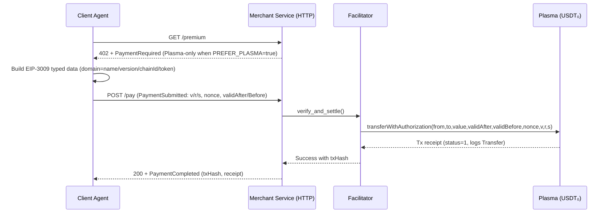

# xUSDT

xUSDT is an x402-compatible agent-to-agent (A2A) payment system that enables autonomous micropayments in USD₮ across two L1 networks:
- Ethereum mainnet: USD₮ (USDT contract) via gasless pull-payments using an EIP‑712 router
- Plasma Layer 1: USD₮0 via native EIP‑3009 `transferWithAuthorization`

References: x402 spec and examples https://github.com/coinbase/x402, Plasma network docs https://docs.plasma.to/

## Features
- x402-style 3-step handshake (Payment Required → Payment Submitted → Payment Completed)
- Multi-network options in a single invoice (Ethereum + Plasma)
- Ethereum: EIP‑712 signed authorizations executed by `PaymentRouter.sol` (pulls approved USDT)
- Plasma: EIP‑3009 gasless transfers via token `transferWithAuthorization`
- Replay protection (per‑payer nonces), deadlines, strict parameter binding
- Python agents (client/merchant) + facilitator for on-chain settlement

## Architecture
- Smart contract (Ethereum): `contracts/PaymentRouter.sol`
  - EIP‑712 domain: `{ name: "PaymentRouter", version: "1", chainId, verifyingContract }`
  - Typehash: `Transfer(address token,address from,address to,uint256 amount,uint256 nonce,uint256 deadline)`
  - Stateless: never holds funds; executes `IERC20(token).transferFrom(from, to, amount)` if signature is valid
- Plasma (no router): call USD₮0 token’s `transferWithAuthorization` (EIP‑3009)
- Off-chain services (Python):
  - `agent/merchant_agent.py`: builds PaymentRequired (both networks), verifies + settles, returns PaymentCompleted
  - `agent/client_agent.py`: auto-selects best option, produces EIP‑712/EIP‑3009 signatures
  - `agent/facilitator.py`: submits on-chain transactions (router/USDT on Ethereum, EIP‑3009 on Plasma)
  - `agent/crypto.py`: typed‑data builders and signers

### Sequence (Plasma USD₮0)


### Components
```mermaid
flowchart LR
    C[Client Agent] -->|HTTP (x402 JSON)| M[Merchant Service]
    M -->|verify/settle| F[Facilitator]
    F -->|JSON-RPC| T[USDT₀ (EIP-3009) on Plasma]
```

Repo map:
- contracts/PaymentRouter.sol — EIP‑712 router
- hardhat.config.js, scripts/deploy.js — build/deploy
- scripts/approve-usdt.js — approve router allowance from payer (Arbitrum/Ethereum)
- scripts/e2e-local-mock.js — full local E2E with MockUSDT (no real funds)
- scripts/client_http.py — simple HTTP client agent for agent-to-agent demo
- agent/config.py — env-driven settings
- agent/*.py — agents, facilitator, crypto, models
- agent/merchant_service.py — FastAPI server exposing `/premium` (402) and `/pay`
- test_flow.py — end‑to‑end demo script
- requirements.txt — pinned Python deps

## Requirements
- Node.js ≥ 18 (Hardhat), npm ≥ 9
- Python ≥ 3.9
- RPC endpoints:
  - Ethereum mainnet (INFURA/Alchemy or self-hosted)
  - Plasma RPC: `https://rpc.plasma.to` (chainId 9745)

## Install
```bash
# Python
python3 -m venv .venv && source .venv/bin/activate
pip install --upgrade pip
pip install -r requirements.txt

# Node
npm install
npx hardhat compile
```

## Configure (.env)
```bash
ETH_RPC=
PLASMA_RPC=https://rpc.plasma.to

# Deployed router address (Ethereum)
ROUTER_ADDRESS=0xPaymentRouterAddress

# Token addresses
USDT_ADDRESS=0xdAC17F958D2ee523a2206206994597C13D831ec7  # USD₮ (USDT) on Ethereum
USDT0_ADDRESS=0xB8CE59FC3717ada4C02eaDF9682A9e934F625ebb  # USD₮0 on Plasma (TetherTokenOFTExtension)

# Chain IDs
ETH_CHAIN_ID=1
PLASMA_CHAIN_ID=9745

# Optional tokens domain overrides for EIP-3009 (use if token name/version are not callable)
USDT0_NAME=USDTe
USDT0_VERSION=1

# Merchant receiving address
MERCHANT_ADDRESS=0xYourMerchantEOA

# Keys (never commit real keys)
RELAYER_PRIVATE_KEY=0x...
CLIENT_PRIVATE_KEY=0x...

# Safety (true skips chain submission)
DRY_RUN=true

# Preference flag (when true, prefer Plasma USD₮0 when configured)
PREFER_PLASMA=false
```

## Build and Deploy (Ethereum)
1) Compile
```bash
npx hardhat compile
```
2) Deploy router (requires funded relayer key)
```bash
ETH_RPC=... RELAYER_PRIVATE_KEY=0x... npx hardhat run scripts/deploy.js --network mainnet
```
3) Set `ROUTER_ADDRESS` in `.env` to the deployed address
4) One‑time approval (payer → router): approve sufficient USDT allowance via wallet or script

## Run the Demo
Dry run (no transactions broadcast):
```bash
source .venv/bin/activate
python test_flow.py
```
Live ETH flow (broadcasts via router):
```bash
DRY_RUN=false ETH_RPC=... ROUTER_ADDRESS=0x... MERCHANT_ADDRESS=0x... \
RELAYER_PRIVATE_KEY=0x... CLIENT_PRIVATE_KEY=0x... python test_flow.py
```

Notes:
- Ethereum path: payer must have approved the router; relayer pays gas
- Plasma path: uses USD₮0 EIP‑3009; facilitator first tries bytes signature variant of `transferWithAuthorization`, then falls back to `(v,r,s)` signature when needed.

## Arbitrum (cheaper gas) quickstart
1) Deploy router to Arbitrum
```bash
ETH_RPC=https://arb1.arbitrum.io/rpc RELAYER_PRIVATE_KEY=0x... npx hardhat run scripts/deploy.js --network arbitrum
```
2) Approve once (payer → router) on Arbitrum USDT
```bash
ETH_RPC=https://arb1.arbitrum.io/rpc \
CLIENT_PRIVATE_KEY=0x... \
USDT_ADDRESS=0xFd086bC7CD5C481DCC9C85ebE478A1C0b69FCbb9 \
ROUTER_ADDRESS=0xDeployedRouter \
node scripts/approve-usdt.js
```
3) Live payment
```bash
DRY_RUN=false \
ETH_RPC=https://arb1.arbitrum.io/rpc ETH_CHAIN_ID=42161 \
USDT_ADDRESS=0xFd086bC7CD5C481DCC9C85ebE478A1C0b69FCbb9 \
ROUTER_ADDRESS=0xDeployedRouter \
MERCHANT_ADDRESS=0xYourMerchant \
RELAYER_PRIVATE_KEY=0x... CLIENT_PRIVATE_KEY=0x... \
python test_flow.py
```

## Plasma quickstart (USD₮0 EIP‑3009)
1) Configure environment
```bash
PLASMA_RPC=https://rpc.plasma.to
PLASMA_CHAIN_ID=9745
USDT0_ADDRESS=0xB8CE59FC3717ada4C02eaDF9682A9e934F625ebb
USDT0_NAME=USDTe
USDT0_VERSION=1
PREFER_PLASMA=true
# Optional amount (atomic units; default 1000000 = 1 USDT0)
PAY_AMOUNT_ATOMIC=100000
```
2) Dry run (no tx broadcast):
```bash
source .venv/bin/activate
python test_flow.py
```
3) Live:
```bash
DRY_RUN=false PLASMA_RPC=https://rpc.plasma.to PLASMA_CHAIN_ID=9745 \
USDT0_ADDRESS=0xB8CE59FC3717ada4C02eaDF9682A9e934F625ebb \
USDT0_NAME=USDTe USDT0_VERSION=1 PREFER_PLASMA=true \
MERCHANT_ADDRESS=0xYourMerchant RELAYER_PRIVATE_KEY=0x... CLIENT_PRIVATE_KEY=0x... \
python test_flow.py
```
The facilitator will call `transferWithAuthorization(from,to,value,validAfter,validBefore,nonce,signature bytes)` and fall back to `(v,r,s)` if needed.

### Plasma-only mode
When `PREFER_PLASMA=true`, the Ethereum option is omitted from PaymentRequired, avoiding any need to set `ROUTER_ADDRESS`.

### Amount control
`PAY_AMOUNT_ATOMIC` lets you choose the payment amount in token units (6 decimals). For example:
```bash
PAY_AMOUNT_ATOMIC=100000  # 0.1 USDT0
```

## Agent-to-Agent over HTTP (x402-style)
Start merchant server (FastAPI):
```bash
source .venv/bin/activate
uvicorn agent.merchant_service:app --host 0.0.0.0 --port 8000
```
Run client agent:
```bash
MERCHANT_URL=http://127.0.0.1:8000 python scripts/client_http.py
```

## MCP server (Claude tools) for Plasma NFT checkout

This repo includes a minimal MCP server that lets Claude link a wallet and say “buy NFT”. It uses WalletConnect v2 to link any EVM wallet and completes payment + mint on Plasma via the HTTP endpoints above.

Prereqs:
- Node.js ≥ 18
- Env: `WC_PROJECT_ID` (WalletConnect Cloud), `MERCHANT_URL` (default `http://127.0.0.1:8000`)
- Merchant must be running with Plasma config and `NFT_CONTRACT` set.

Install and run:
```bash
cd mcp
npm install
WC_PROJECT_ID=... MERCHANT_URL=http://127.0.0.1:8000 npm start
# In Claude, add this MCP as a custom tool (stdio). Call tools:
# - wallet_link_start → returns a WC URI (also printed as a QR in logs)
# - wallet_link_status → { status, address }
# - get_wallet_address → { address }
# - buy_nft { sku: "premium" } → returns PaymentCompleted with txHash and tokenId
```

Notes:
- The server builds EIP‑3009 typed data for Plasma USD₮0 and requests an `eth_signTypedData_v4` signature from the linked wallet. It then POSTs `/pay` to the merchant.
- Configure token domain overrides if your USD₮0 token does not expose name/version on-chain: set `USDT0_NAME` and `USDT0_VERSION`.

References
- Coinbase org (x402, agentkit, payments-mcp, etc.): [https://github.com/coinbase](https://github.com/coinbase)
Flow:
1) GET /premium → returns 402 with PaymentRequired (Plasma-only if `PREFER_PLASMA=true`)
2) Client signs (EIP-3009) and POST /pay with PaymentSubmitted
3) Server settles on Plasma and returns PaymentCompleted with txHash

## x402 Message Shapes
PaymentRequired (server → client):
```json
{
  "type": "payment-required",
  "invoiceId": "uuid-12345",
  "timestamp": 1704067200,
  "paymentOptions": [
    {
      "network": "ethereum",
      "chainId": 1,
      "token": "0xdAC17F958D2ee523a2206206994597C13D831ec7",
      "tokenSymbol": "USDT",
      "amount": "5000000",
      "decimals": 6,
      "recipient": "0xMerchant",
      "scheme": "erc20-gasless-router",
      "routerContract": "0xRouter",
      "nonce": 0,
      "deadline": 1704067500
    },
    {
      "network": "plasma",
      "chainId": 9745,
      "token": "0xUSDT0",
      "tokenSymbol": "USDT0",
      "amount": "5000000",
      "decimals": 6,
      "recipient": "0xMerchant",
      "scheme": "eip3009-transfer-with-auth",
      "nonce": "0x…32bytes",
      "deadline": 1704067500
    }
  ],
  "description": "Payment for premium API access"
}
```

PaymentSubmitted (client → server):
```json
{
  "type": "payment-submitted",
  "invoiceId": "uuid-12345",
  "chosenOption": {
    "network": "ethereum",
    "chainId": 1,
    "token": "0xdAC…",
    "amount": "5000000",
    "from": "0xClient",
    "to": "0xMerchant",
    "nonce": 0,
    "deadline": 1704067500
  },
  "signature": { "v": 27, "r": "0x…", "s": "0x…" },
  "scheme": "erc20-gasless-router"
}
```

PaymentCompleted (server → client):
```json
{
  "type": "payment-completed",
  "invoiceId": "uuid-12345",
  "txHash": "0x…",
  "network": "ethereum",
  "status": "confirmed",
  "receipt": { "blockNumber": 123456, "gasUsed": 76543 }
}
```

## EIP‑712 / EIP‑3009 Details
- Router (Ethereum, typed data `Transfer`): binds token, from, to, amount, nonce, deadline to prevent parameter tampering and replay
- USD₮0 (Plasma, EIP‑3009 `TransferWithAuthorization`): uses `from, to, value, validAfter, validBefore, nonce` with token’s domain (name, version, chainId, verifyingContract)

## Operational Guidance
- Nonces: router keeps `nonces[from]` (sequential). Clients should query via `eth_call` before signing; the contract enforces on-chain.
- Deadlines: keep short (e.g., 5–10 minutes) and reject expired authorizations server-side.
- Idempotency: map `invoiceId → txHash`; ignore duplicate submissions after confirmed settlement.
- Gas: relayer pays ETH gas for Ethereum; Plasma USD₮0 is gasless for transfers.

## Security
- Never commit private keys; use a secure vault in production
- Verify `to == MERCHANT_ADDRESS` server-side before submitting any on-chain call
- Enforce exact amount/decimals match; reject under/over‑payment
- Consider rate limits and minimums on Ethereum to cover gas

### Bullet‑proofing checklist
- Signature domains
  - EIP‑712: chainId and verifyingContract must match deployed router (if used)
  - EIP‑3009: use the token’s on-chain name/version where exposed; otherwise allow explicit overrides
- Nonces and expiry
  - Router: fetch `nonces[from]` via eth_call before signing; enforce increment on-chain
  - EIP‑3009: generate 32‑byte nonce; include `validAfter`/`validBefore`; allow small clock drift
- Payload validation
  - Strictly bind token/from/to/amount/nonce/deadline in signatures
  - Check `recipient == MERCHANT_ADDRESS`
  - Optionally pre‑check `balanceOf(from) >= amount` on Plasma to fail fast
- Transport & idempotency
  - Use `invoiceId` mapping to ignore duplicates after success
  - Map reverts to structured x402 error fields (invalid_signature, expired, insufficient_funds, nonce_mismatch, etc.)
- Observability
  - Log txHash and minimal receipt fields; redact secrets; structure logs by invoiceId
- Malleability & recovery
  - Router uses OZ ECDSA.recover; EIP‑3009 is validated by token contract
- Amount controls
  - `PAY_AMOUNT_ATOMIC` env to cap or choose payment size (supports micros)

## v0 demo plan (UI-assisted showcase)
Goal: a v0 app that demonstrates end‑to‑end x402 payments on Plasma.

### Pages / flows
- Merchant dashboard
  - Shows current configuration (Plasma RPC, token address, merchant address)
  - Button: “Start merchant server” (or show deployed URL)
- Client demo
  - Inputs: Merchant URL, amount (atomic or decimals), payer key (local only)
  - Button 1: “Request resource” → displays PaymentRequired JSON
  - Button 2: “Sign & Pay” → constructs EIP‑3009, POSTs /pay, shows tx hash
- Explorer linkouts
  - Link to Plasma explorer with tx hash

### Backend wiring
- Reuse `agent/merchant_service.py` as the merchant endpoint
- Reuse `scripts/client_http.py` logic inside the v0 server action or via client API call
- Provide env controls for PREFER_PLASMA, USDT0_ADDRESS, PAY_AMOUNT_ATOMIC

### Hardening for v0
- Never transmit private keys to the server (sign in the browser or local worker)
- If server‑side signing is necessary for demo, restrict to test values and clearly warn users
- Redact secrets in logs; show only tx hashes and minimal receipts
