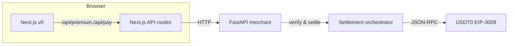
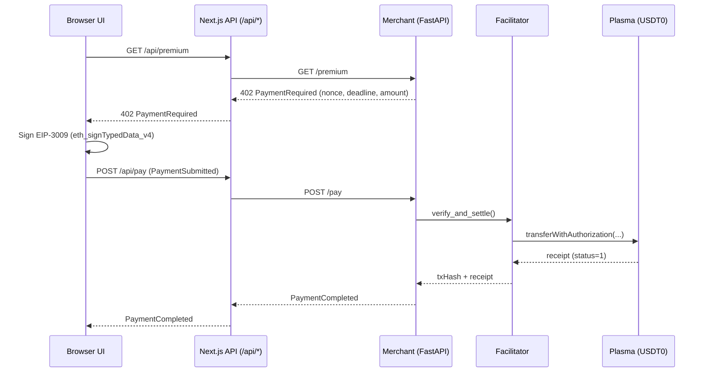

# xUSDT — x402 A2A payments on Plasma (USD₮/USD₮0)

NOTE: Plasma payloads work.
Ux still very buggy.
Not tested the MCP / NFT / ETH / ARB sections yet enough to be fully satisfactory.

Minimal, production‑leaning reference for x402‑style agent‑to‑agent payments:
- Ethereum: USD₮ via EIP‑712 gasless router (pull)
- Plasma (Layer 1): USD₮0 via EIP‑3009 `transferWithAuthorization` (push)

Links: x402 spec and examples ([github.com/coinbase/x402](https://github.com/coinbase/x402)), Plasma docs ([docs.plasma.to](https://docs.plasma.to/)).

---

## What’s in the box
- x402 handshake: PaymentRequired → PaymentSubmitted → PaymentCompleted
- Dual‑network invoices (Ethereum + Plasma) with fee hints
- Merchant FastAPI (`agent/merchant_service.py`), settlement orchestrator, and optional NFT receipt
- Next.js demo app (`v0/`) with wallet flow and status lamp
- Solidity contracts (router, channels, NFT receipt router)

## 10‑minute Quickstart (browser demo)
1) Start merchant (Plasma):
```bash
# repo root
export PYTHONPATH=.
export PLASMA_RPC=https://rpc.plasma.to
export PLASMA_CHAIN_ID=9745
export ETH_RPC=https://ethereum.publicnode.com
export MERCHANT_ADDRESS=0xYourMerchant
export RELAYER_PRIVATE_KEY=0x...
export CLIENT_PRIVATE_KEY=0x...
export PREFER_PLASMA=true

uvicorn agent.merchant_service:app --host 127.0.0.1 --port 8000
```
Alternatively, you can place these in a `.env` and source them before running (for example: `set -a; . ./.env; set +a`), or keep them inline as a single-line prefix if you prefer a compact form.
2) Start Next.js:
```bash
cd v0 && npm run dev
# open http://localhost:3000/client
```
3) In the UI:
- Connect Wallet → Request resource (402) → Sign & Pay (EIP‑3009)
- Re‑request resource to see 200 when unlocked

Default amounts:
- Premium: 0.1 USDT0 (100,000 atomic)
- Unknown SKU: 0.01 USDT0 (10,000 atomic)

## API quickstart (HTTP)
- Request invoice
```bash
curl -s "http://127.0.0.1:8000/premium" | jq
```
- Submit signed payment
```bash
curl -s -X POST "http://127.0.0.1:8000/pay" \
  -H 'content-type: application/json' \
  -d '{"type":"payment-submitted","invoiceId":"...", "chosenOption":{...}, "signature":{...}, "scheme":"eip3009-transfer-with-auth"}' | jq
```
- Check invoice
```bash
curl -s "http://127.0.0.1:8000/invoice/<invoiceId>" | jq
```

## Architecture at a glance


### EIP‑3009 payment sequence


## Configuration (.env)
Copy `env.example` to `.env` and set at minimum:
```env
ETH_RPC=...
PLASMA_RPC=https://rpc.plasma.to
PLASMA_CHAIN_ID=9745
USDT_ADDRESS=0xdAC17F958D2ee523a2206206994597C13D831ec7
USDT0_ADDRESS=0xB8CE59FC3717ada4C02eaDF9682A9e934F625ebb
MERCHANT_ADDRESS=0xYourMerchantEOA
RELAYER_PRIVATE_KEY=0x...(never commit)
CLIENT_PRIVATE_KEY=0x...(never commit)
PREFER_PLASMA=true
```
Optional (token domain overrides when name/version aren’t callable): `USDT0_NAME=USDTe`, `USDT0_VERSION=1`.

## Endpoints (merchant)
- GET `/health` → `{ ok, ts }`
- GET `/premium` → 402 PaymentRequired unless `?invoiceId` is confirmed
- GET `/product/{sku}` → 402 PaymentRequired for catalog/default
- POST `/pay` → `PaymentCompleted` after settlement
- GET `/invoice/{invoiceId}` → `{ status }` or stored `PaymentCompleted`
- (NFT demo) GET `/premium-nft`, POST `/pay-nft`

## Message shapes (x402)
- PaymentRequired: `{ type: "payment-required", invoiceId, timestamp, paymentOptions[], description? }`
- PaymentSubmitted: `{ type: "payment-submitted", invoiceId, chosenOption{...}, signature{v,r,s}, scheme }`
- PaymentCompleted: `{ type: "payment-completed", invoiceId, txHash, network, status, receipt?, tokenId? }`

## Troubleshooting
- 402 loops: you didn’t POST a valid PaymentSubmitted yet (or it failed). Sign again within deadline.
- ERC20: transfer amount exceeds balance: fund payer with enough USDT0.
- 422 from `/pay`: payload missing fields; send full `PaymentSubmitted`.
- 500 from `/pay`: fixed; responses now normalize web3 types to JSON‑safe values.
- Body is unusable: fixed in Next.js API (read upstream body once).

## Development
- Install: `npm ci` (root and `v0/`), `pip install -r requirements.txt`
- Run merchant: `uvicorn agent.merchant_service:app --host 127.0.0.1 --port 8000`
- Run UI: `cd v0 && npm run dev`
- Contracts: `npx hardhat compile`

## Structure
- `agent/` FastAPI, settlement, EIP‑712/3009 helpers
- `contracts/` Router, channels, NFT receipt router
- `v0/` Next.js demo UI and API proxy
- `scripts/` Deploy/util scripts; `tests/` Python tests; `test/` Hardhat tests

## Security notes
- Never commit private keys. `.gitignore` excludes `.env`.
- Server checks `recipient == MERCHANT_ADDRESS`, amount, decimals, and deadlines.

## Versioning
- Working snapshot tags: `working-YYYYMMDD-HHMMSS`. Latest: see `git tag -l 'working-*'`.

---

© 2025. Plasma is a Layer 1 blockchain. Use USD₮/USD₮0 naming consistently.
