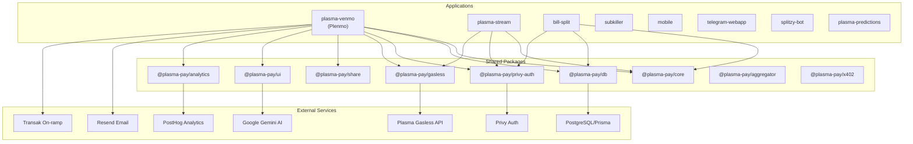
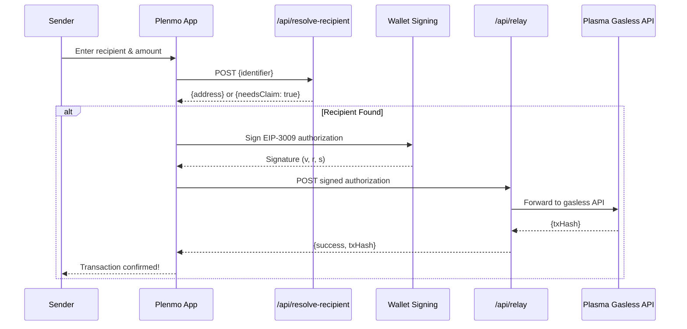
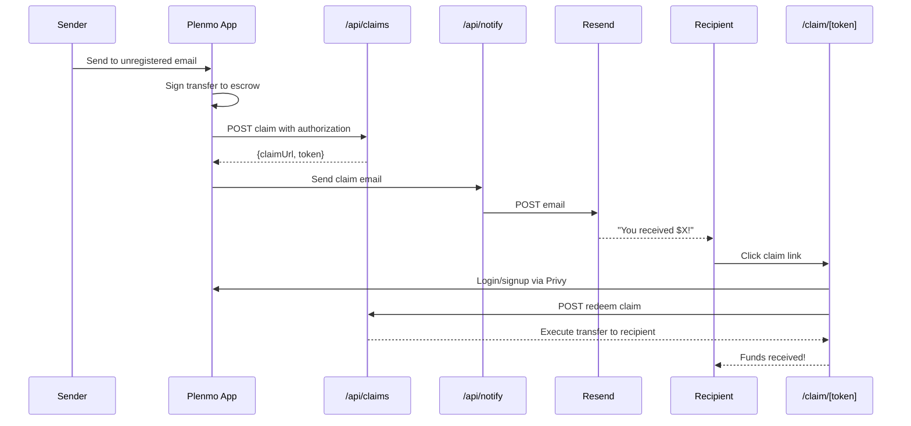
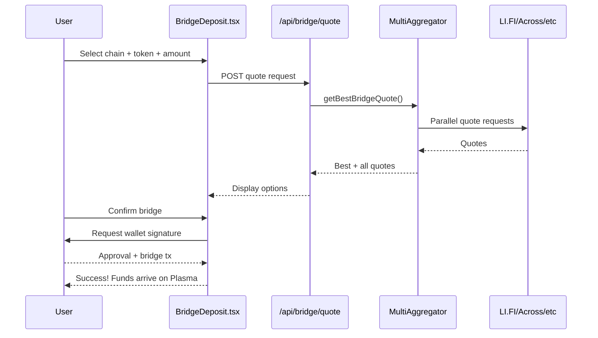

# Plasma SDK Codebase Map

> Auto-generated by Cartographer. Last mapped: 2026-01-15

## Recent Changes (Since Jan 14)
- **External Wallet Payments** - Users can now pay/claim using MetaMask, Rabby, etc.
- **Bridge Deposit Feature** - Multi-aggregator bridge (LI.FI, deBridge, Squid, Across)
- **PostHog Integration** - Analytics tracking across all apps
- **Vercel Deployment Fixes** - Monorepo build configuration resolved

## System Overview

Plasma SDK is a monorepo containing multiple payment applications and shared packages built on Plasma Chain, enabling gasless USDT0 transfers via EIP-3009.



## Directory Structure

```
plasma-sdk/
├── apps/                          # Application packages
│   ├── plasma-venmo/              # Main Plenmo P2P payment app (Port 3002)
│   ├── plasma-stream/             # Streaming payments app (Port 3003)
│   ├── bill-split/                # Bill splitting app (Port 3004)
│   ├── subkiller/                 # Subscription management (Port 3001)
│   ├── mobile/                    # React Native mobile app
│   ├── telegram-webapp/           # Telegram Mini App
│   ├── splitzy-bot/               # Telegram bot for bill splitting
│   ├── plasma-predictions/        # Prediction market app
│   └── ENV_SETUP.md               # Environment variable documentation
│
├── packages/                      # Shared packages
│   ├── core/                      # Types, constants, chain configs
│   ├── db/                        # Prisma database client & helpers
│   ├── privy-auth/                # Privy authentication wrapper
│   ├── gasless/                   # EIP-3009 gasless transfer utilities
│   ├── share/                     # Social sharing (WhatsApp, Telegram, SMS)
│   ├── ui/                        # Shared UI components & AI Assistant
│   ├── analytics/                 # PostHog event tracking
│   ├── aggregator/                # Token swap aggregation (LiFi)
│   └── x402/                      # HTTP 402 payment protocol
│
├── tests/                         # E2E Playwright tests
├── scripts/                       # Build and deployment scripts
├── docs/                          # Documentation
└── turbo.json                     # Turborepo configuration
```

## Package Guide

### @plasma-pay/core

**Purpose**: Core types, constants, and chain configurations for all Plasma SDK apps.

**Entry point**: `packages/core/src/index.ts`

**Key exports**:
| Export | Purpose |
|--------|---------|
| `PLASMA_MAINNET_CHAIN_ID` | Chain ID 9745 |
| `USDT0_ADDRESS` | USDT0 token contract address |
| `plasmaMainnet` | Viem chain configuration |
| `TransferWithAuthorizationParams` | EIP-3009 transfer type |
| `PaymentOption`, `PaymentRequired` | Payment protocol types |
| `Stream`, `Subscription` | App-specific types |

**Environment Variables**: None required

---

### @plasma-pay/db

**Purpose**: Prisma-based database client with helper functions for all data models.

**Entry point**: `packages/db/src/index.ts`

**Key exports**:
| Export | Purpose |
|--------|---------|
| `prisma` | Singleton PrismaClient instance |
| `paymentLinks` | CRUD helpers for payment links |
| `paymentRequests` | CRUD helpers for payment requests |
| `claims` | CRUD helpers for claim tokens |
| `notifications` | Notification queue management |
| `invoices` | Invoice management (x402) |
| `bills` | Bill splitting with participants |
| `generateClaimToken()` | Secure token generation |

**Database Models**:
- `PaymentLink` - Shareable payment URLs
- `PaymentRequest` - Money request from user to user
- `Claim` - Escrow for unregistered recipients
- `Notification` - Email notification queue
- `Invoice` - HTTP 402 payment invoices
- `Bill`, `BillItem`, `BillParticipant` - Bill splitting
- `Activity`, `Contact`, `UserSettings` - User data
- `Stream` - Payment streaming records
- `GasSponsorshipLog` - Gas sponsorship tracking

**Environment Variables**:
| Variable | Required | Description |
|----------|----------|-------------|
| `DATABASE_URL` | Yes | PostgreSQL connection string |

---

### @plasma-pay/privy-auth

**Purpose**: Privy authentication wrapper with Plasma-specific wallet functionality.

**Entry point**: `packages/privy-auth/src/index.ts`

**Key exports**:
| Export | Purpose |
|--------|---------|
| `PlasmaPrivyProvider` | Main provider component |
| `createPlasmaProviders` | Provider factory for apps |
| `usePlasmaWallet()` | Get wallet, login/logout |
| `useGaslessTransfer()` | Sign EIP-3009 transfers |
| `useUSDT0Balance()` | Query USDT0 balance |
| `useFundWallet()` | Wallet funding (MoonPay, etc.) |
| `useConnectExternalWallet()` | Connect MetaMask, etc. |
| `useAllWallets()` | Access all connected wallets |
| `MockPrivyProvider` | Dev mode without Privy |

**Environment Variables**:
| Variable | Required | Description |
|----------|----------|-------------|
| `NEXT_PUBLIC_PRIVY_APP_ID` | Yes | Privy application ID |
| `PRIVY_APP_ID` | Yes (server) | Privy app ID (server-side) |
| `PRIVY_APP_SECRET` | Yes (server) | Privy app secret |

---

### @plasma-pay/gasless

**Purpose**: EIP-3009 gasless transfer implementation for USDT0.

**Entry point**: `packages/gasless/src/index.ts`

**Key exports**:
| Export | Purpose |
|--------|---------|
| `createTransferParams()` | Generate transfer authorization params |
| `buildTransferAuthorizationTypedData()` | Build EIP-712 typed data |
| `validateTransferParams()` | Validate authorization |
| `submitToRelayer()` | Submit to gasless API |
| `executeOnChain()` | Direct on-chain execution |
| `createRelayerClient()` | Relayer client factory |
| `createRelayHandler()` | Next.js API route handler |
| `PLASMA_GASLESS_LIMITS` | Rate limit constants |

**Plasma Gasless API Rate Limits**:
- 10 transfers per day per address
- 10,000 USDT0 daily volume per address
- 20 transfers per day per IP
- Minimum: 1 USDT0
- Resets at 00:00 UTC

**Environment Variables**:
| Variable | Required | Description |
|----------|----------|-------------|
| `RELAYER_PRIVATE_KEY` | Optional | Local relayer wallet key |
| `PLASMA_RELAYER_API` | Optional | External relayer URL |
| `PLASMA_RELAYER_SECRET` | Optional | Relayer API secret |

---

### @plasma-pay/share

**Purpose**: Social sharing utilities for WhatsApp, Telegram, SMS, email, and native share.

**Entry point**: `packages/share/src/index.ts`

**Key exports**:
| Export | Purpose |
|--------|---------|
| `generateWhatsAppUrl()` | WhatsApp share link |
| `generateTelegramShareUrl()` | Telegram share link |
| `generateSMSUrl()` | SMS share link |
| `share()` | Unified share function |
| `generateShortCode()` | Short URL codes |
| `createShareUrl()` | Universal/deep links |
| `nativeShare()` | Web Share API |
| `copyToClipboard()` | Clipboard utility |

---

### @plasma-pay/ui

**Purpose**: Shared React components and AI Assistant.

**Entry point**: `packages/ui/src/index.ts`

**Key exports**:
| Export | Purpose |
|--------|---------|
| `Button`, `Input`, `Modal` | Base components |
| `Card`, `Spinner`, `Badge` | UI primitives |
| `Toast`, `EmptyState` | Feedback components |
| `WalletManager` | Wallet display component |
| `PaymentConfirmModal` | Payment confirmation |
| `ShareSheet`, `SuccessShare` | Share UI |
| `InviteFriends` | Referral UI |
| `AssistantProvider`, `Assistant` | AI Assistant |
| `ErrorBoundary` | Error handling |

**AI Assistant Features**:
- Context-aware help based on current page
- Voice interaction (speech synthesis)
- Personality engine with emoji reactions
- Knowledge base for Plenmo features

**Environment Variables**:
| Variable | Required | Description |
|----------|----------|-------------|
| `NEXT_PUBLIC_GEMINI_API_KEY` | Optional | Google Gemini API key |

---

### @plasma-pay/analytics

**Purpose**: PostHog event tracking for analytics.

**Entry point**: `packages/analytics/src/index.ts`

**Environment Variables**:
| Variable | Required | Description |
|----------|----------|-------------|
| `NEXT_PUBLIC_POSTHOG_KEY` | Optional | PostHog API key |
| `NEXT_PUBLIC_POSTHOG_HOST` | Optional | PostHog host URL |

---

### @plasma-pay/aggregator

**Purpose**: Cross-chain token swap aggregation via LiFi.

**Entry point**: `packages/aggregator/src/index.ts`

**Key exports**:
- `getSwapQuote()` - Get swap quotes
- `executeSwap()` - Execute token swaps
- `SwapQuote`, `SwapRequest` types

---

### @plasma-pay/x402

**Purpose**: HTTP 402 Payment Required protocol implementation.

**Entry point**: `packages/x402/src/index.ts`

**Key exports**:
- `createPaymentMiddleware()` - Express/Next.js middleware
- `createFacilitator()` - Payment facilitator
- `PaymentRequired`, `PaymentSubmitted` types

---

## Application: plasma-venmo (Plenmo)

**Purpose**: Main P2P payment application - "Venmo for crypto"

**Port**: 3002

### API Routes

| Route | Method | Purpose |
|-------|--------|---------|
| `/api/relay` | POST/GET | Forward to Plasma gasless API |
| `/api/submit-transfer` | POST | Submit signed transfers |
| `/api/claims` | GET/POST | Create/list claim tokens |
| `/api/claims/[token]` | GET/POST | Get/redeem specific claim |
| `/api/payment-links` | GET/POST | Create/list payment links |
| `/api/payment-links/[id]` | GET/PUT | Get/pay specific link |
| `/api/requests` | GET/POST | Create/list payment requests |
| `/api/requests/[id]` | GET/PUT | Get/fulfill request |
| `/api/notify` | GET/POST | Send/process notifications |
| `/api/contacts` | GET/POST | Manage contacts |
| `/api/search` | GET | Search users |
| `/api/feed` | GET | Activity feed |
| `/api/history` | GET | Transaction history |
| `/api/resolve-recipient` | POST | Resolve email/phone to address |
| `/api/gas-sponsorship` | POST | Check gas sponsorship eligibility |
| `/api/share-links` | GET/POST | Short share link management |
| `/api/referrals` | GET/POST | Referral program |
| `/api/user-settings` | GET/PUT | User preferences |
| `/api/avatar/*` | POST | AI avatar generation |

### Pages

| Page | Purpose |
|------|---------|
| `/` | Dashboard with wallet, send form, activity |
| `/pay` | Quick pay page |
| `/pay/[linkId]` | Pay a specific payment link |
| `/claim/[token]` | Claim funds page |
| `/settings` | User settings |
| `/invite` | Referral/invite page |

### Key Components

| Component | Purpose |
|-----------|---------|
| `SendMoneyForm` | Main send money form with recipient resolution |
| `RequestMoneyForm` | Request money from contacts |
| `PaymentLinks` | Create/manage payment links |
| `PaymentRequests` | View/fulfill incoming requests |
| `TransactionHistory` | Transaction list |
| `WalletManager` | Wallet display with balance |
| `FundWallet` | Add funds via Transak/external wallet |
| `ContactList` | Contact management |
| `SearchBar` | User/contact search |
| `SocialFeed` | Activity feed display |
| `Header` | App header with navigation |
| `ExternalWalletPay` | Pay from external wallet |

### Environment Variables

| Variable | Required | Description |
|----------|----------|-------------|
| `NEXT_PUBLIC_PRIVY_APP_ID` | Yes | Privy app ID |
| `PRIVY_APP_ID` | Yes | Privy app ID (server) |
| `PRIVY_APP_SECRET` | Yes | Privy app secret |
| `DATABASE_URL` | Yes | PostgreSQL URL |
| `RESEND_API_KEY` | Optional | Resend email API key |
| `RESEND_FROM_EMAIL` | Optional | Email sender address |
| `NEXT_PUBLIC_APP_URL` | Optional | App base URL |
| `NEXT_PUBLIC_TRANSAK_API_KEY` | Optional | Transak on-ramp key |
| `NEXT_PUBLIC_TRANSAK_ENV` | Optional | STAGING/PRODUCTION |
| `NEXT_PUBLIC_MERCHANT_ADDRESS` | Optional | Escrow wallet address |
| `NEXT_PUBLIC_POSTHOG_KEY` | Optional | PostHog key |
| `NEXT_PUBLIC_GEMINI_API_KEY` | Optional | Gemini AI key |

---

## Payment Flows

### Direct Transfer Flow



### Claim Flow (Unregistered Recipient)



### Payment Link Flow

```mermaid
sequenceDiagram
    participant Creator as Link Creator
    participant App as Plenmo App
    participant Links as /api/payment-links
    participant Share as Share Sheet
    participant Payer as Payer
    participant PayPage as /pay/[linkId]

    Creator->>App: Create payment link
    App->>Links: POST {amount, memo}
    Links-->>App: {payUrl}
    App->>Share: Show share options
    Creator->>Share: Share via WhatsApp/SMS/etc
    
    Payer->>PayPage: Open payment link
    PayPage->>Links: GET link details
    PayPage->>Payer: Show pay form
    Payer->>App: Confirm payment
    App->>App: Sign & relay transfer
    App->>Links: Mark link as paid
    Links-->>App: Success
```

---

## Data Flow

### Gasless Transfer Architecture

```
┌─────────────────────────────────────────────────────────────────────┐
│                         Client (Browser)                             │
│  ┌──────────────┐    ┌──────────────┐    ┌──────────────────────┐   │
│  │ usePlasma-   │───▶│ useGasless-  │───▶│ Privy Embedded Wallet│   │
│  │ Wallet()     │    │ Transfer()   │    │ (eth_signTypedData)  │   │
│  └──────────────┘    └──────────────┘    └──────────────────────┘   │
│                             │                                        │
│                             ▼                                        │
│                    ┌──────────────┐                                  │
│                    │ Signed Auth  │                                  │
│                    │ {v, r, s}    │                                  │
│                    └──────────────┘                                  │
└─────────────────────────────────────────────────────────────────────┘
                              │
                              ▼
┌─────────────────────────────────────────────────────────────────────┐
│                         Server (Next.js API)                         │
│  ┌──────────────┐    ┌──────────────┐    ┌──────────────────────┐   │
│  │ /api/relay   │───▶│ createRelay- │───▶│ Forward to Plasma    │   │
│  │              │    │ Handler()    │    │ Gasless API          │   │
│  └──────────────┘    └──────────────┘    └──────────────────────┘   │
└─────────────────────────────────────────────────────────────────────┘
                              │
                              ▼
┌─────────────────────────────────────────────────────────────────────┐
│                    Plasma Gasless API (api.plasma.to)                │
│  ┌──────────────┐    ┌──────────────┐    ┌──────────────────────┐   │
│  │ Validate     │───▶│ Execute      │───▶│ USDT0 Contract       │   │
│  │ Authorization│    │ On-Chain     │    │ transferWithAuth()   │   │
│  └──────────────┘    └──────────────┘    └──────────────────────┘   │
└─────────────────────────────────────────────────────────────────────┘
```

---

## Conventions

### Naming Conventions
- **Files**: kebab-case for routes, PascalCase for components
- **Types**: PascalCase with descriptive names
- **API Routes**: REST-style with Next.js App Router
- **Environment Variables**: SCREAMING_SNAKE_CASE

### Patterns Used
- **Monorepo**: Turborepo with npm workspaces
- **Database**: Prisma ORM with PostgreSQL
- **Auth**: Privy embedded wallets + social login
- **Gasless**: EIP-3009 TransferWithAuthorization
- **Styling**: Tailwind CSS with dark theme
- **State**: React hooks + context
- **API**: Next.js App Router route handlers

### Error Handling
- API routes return `{success, error}` or `{success, data}`
- Rate limiting via in-memory store or Redis
- Retry logic with exponential backoff

---

## Gotchas & Non-Obvious Behavior

### EIP-3009 Signing
- **IMPORTANT**: The EIP-712 domain name MUST be `"USDT0"` (not `"USD₮0"`)
- Using wrong name causes signature validation to fail on-chain
- Always use `USDT0_EIP712_DOMAIN` from `@plasma-pay/core`

### Gasless API Rate Limits
- Limits are PER USER ADDRESS, not per app
- 10 transfers/day, 10k USDT0/day volume
- Resets at 00:00 UTC
- Check limits via GET /api/relay before allowing user action

### Claim Token Security
- Tokens are hashed before storage (SHA-256)
- Plain token returned ONLY on creation - never retrievable again
- Claims expire in 30 days by default

### Database Singleton
- Prisma client uses singleton pattern to prevent connection exhaustion
- In development, stored on `global.prisma`
- Check `DATABASE_URL` exists before operations

### Privy Mock Mode
- When `NEXT_PUBLIC_PRIVY_APP_ID` not set, uses MockPrivyProvider
- Allows development without Privy account
- Mock wallet has hardcoded test address

### Transak Integration
- Requires separate API key from transak.com
- STAGING vs PRODUCTION environments
- Only supports USDT on Plasma network
- Wallet address pre-filled, user cannot change

### Email Notifications
- Resend SDK used for email delivery
- Falls back to console.log if `RESEND_API_KEY` not set
- HTML templates are inline in `/api/notify/route.ts`
- Queue processing via GET `/api/notify?process=true`

---

## Navigation Guide

**To add a new API endpoint**:
1. Create route file in `apps/plasma-venmo/src/app/api/[route]/route.ts`
2. Export GET/POST/PUT/DELETE handlers
3. Add rate limiting from `@/lib/rate-limiter`
4. Add to this documentation

**To add a new component**:
1. Create in `apps/plasma-venmo/src/components/` or `packages/ui/src/components/`
2. If reusable, add to `packages/ui` and export from index
3. Use Tailwind classes with dark theme

**To add a new database model**:
1. Update Prisma schema in app's `prisma/schema.prisma`
2. Run `npx prisma migrate dev`
3. Add helper functions to `packages/db/src/index.ts`
4. Export types

**To add environment variable**:
1. Add to `.env.local` in relevant app
2. Document in `apps/ENV_SETUP.md`
3. Add to this document

**To modify auth behavior**:
1. Edit `packages/privy-auth/src/hooks.ts`
2. Or customize in app's `providers.tsx`

**To modify gasless transfer**:
1. Edit `packages/gasless/src/eip3009.ts` for typed data
2. Edit `packages/gasless/src/relayer.ts` for relay logic
3. Edit `packages/gasless/src/relay-handler.ts` for API handler

---

## Focus Area: Plenmo Payment System

Plenmo (plasma-venmo) is the main P2P payment application. Key components:

### Core Payment Files
| File | Purpose |
|------|---------|
| `src/components/SendMoneyForm.tsx` | Main send money UI with recipient resolution |
| `src/lib/send.ts` | Payment execution logic |
| `src/app/api/submit-transfer/route.ts` | Relayer endpoint for gasless transfers |
| `src/app/api/resolve-recipient/route.ts` | Email/phone → wallet address resolution |
| `src/app/api/claims/route.ts` | Claim token management for unregistered recipients |

### Payment Hooks (from @plasma-pay/privy-auth)
```typescript
usePlasmaWallet()      // Get wallet, login/logout
useGaslessTransfer()   // Sign EIP-3009 transfers  
useUSDT0Balance()      // Query USDT0 balance
useFundWallet()        // Wallet funding (MoonPay, etc.)
useConnectExternalWallet() // Connect MetaMask, Rabby
useAllWallets()        // Access all connected wallets
```

---

## Focus Area: External Wallet Integration

Allows users to pay from external wallets (MetaMask, Rabby, WalletConnect).

### Key Files
| File | Purpose |
|------|---------|
| `src/components/ExternalWalletPay.tsx` | UI for paying via external wallet |
| `packages/privy-auth/src/hooks.ts` | `useConnectExternalWallet()`, `useAllWallets()` hooks |
| `src/app/claim/[token]/page.tsx` | Claim page with external wallet support |
| `src/app/pay/[linkId]/page.tsx` | Payment link page with external wallet option |

### Implementation Notes
- External wallets connect via Privy's `useConnectWallet` hook
- Users switch to Plasma Chain (ID: 9745) before transactions
- For external wallets, user pays gas (unlike embedded wallets)
- USDT0 address: `0xB8CE59FC3717ada4C02eaDF9682A9e934F625ebb`

---

## Focus Area: Bridge Deposit Functionality

Multi-aggregator bridge for converting any token to USDT0 on Plasma.

### Key Files
| File | Purpose |
|------|---------|
| `src/components/BridgeDeposit.tsx` | Bridge UI modal with chain/token selection |
| `src/components/FundWallet.tsx` | Fund wallet modal (includes bridge option) |
| `src/app/api/bridge/quote/route.ts` | Quote aggregation API |
| `src/app/api/bridge/transaction/route.ts` | Transaction building API |
| `packages/aggregator/src/multi-aggregator.ts` | Multi-provider aggregation logic |

### Bridge Providers
| Provider | Speed | Best For |
|----------|-------|----------|
| LI.FI | Medium | Wide token coverage |
| deBridge | Medium | Large amounts |
| Squid | Medium | Cross-chain swaps |
| Across | Fast ⚡ | Quick transfers |

### Supported Source Chains
- Ethereum (1), Arbitrum (42161), Optimism (10)
- Base (8453), Polygon (137), BNB Chain (56), Avalanche (43114)

### Bridge Flow


---

## Focus Area: Vercel Deployment Configuration

### Monorepo Structure (Critical)
```
plasma-sdk/
├── vercel.json          # Root config - turbo build
├── apps/
│   └── plasma-venmo/
│       └── vercel.json  # App-specific config
```

### Root vercel.json (plasma-sdk/vercel.json)
```json
{
  "framework": "nextjs",
  "buildCommand": "npx turbo build --filter=@plasma-pay/venmo",
  "outputDirectory": "apps/plasma-venmo/.next",
  "installCommand": "npm install"
}
```

### Deployment Rules
1. **Always deploy from app directory**: `cd apps/plasma-venmo`
2. **Never set rootDirectory** in Vercel dashboard - causes path doubling
3. **Node.js Version**: Must be 20.x (not 24.x)
4. **Run verification first**: `./scripts/verify-vercel.sh`

### Common Deployment Errors
| Error | Cause | Fix |
|-------|-------|-----|
| `path "X/apps/plasma-venmo" does not exist` | Doubled root directory | Clear rootDirectory in Vercel dashboard |
| `invalid Node.js Version: "24.x"` | Invalid Node version | Set to 20.x in Vercel dashboard |
| `ENOWORKSPACES` | npm workspace issue | Ignore - not blocking |

---

## Focus Area: PostHog Integration

Analytics tracking across all apps using PostHog.

### Setup Files
| File | Purpose |
|------|---------|
| `packages/analytics/src/provider.tsx` | React provider for PostHog |
| `packages/analytics/src/events.ts` | Event type definitions |
| `apps/plasma-venmo/src/lib/posthog.ts` | App-specific PostHog init |
| `apps/plasma-venmo/src/app/providers.tsx` | Provider integration |

### Environment Variables
```env
NEXT_PUBLIC_POSTHOG_KEY=phc_xxxxx        # PostHog project API key
NEXT_PUBLIC_POSTHOG_HOST=https://us.i.posthog.com  # PostHog host
```

### PostHog Initialization (plasma-venmo)
```typescript
// src/lib/posthog.ts
posthog.init(NEXT_PUBLIC_POSTHOG_KEY, {
  api_host: NEXT_PUBLIC_POSTHOG_HOST,
  capture_pageview: true,
  capture_pageleave: true,
  session_recording: {
    maskAllInputs: false,
    maskTextSelector: ".mask-text",
  },
  loaded: (posthog) => {
    posthog.register({ app: "plasma-venmo" });
  },
});
```

### Tracked Events (Bridge-specific)
- `bridge_wallet_required` - User needs to connect wallet
- `bridge_initiated` - Bridge transaction started
- `bridge_transaction_sent` - Transaction submitted
- `bridge_success` - Bridge completed successfully
- `bridge_error` - Bridge failed

### Usage in Components
```typescript
import { posthog } from "@/lib/posthog";

// Track event
posthog?.capture("bridge_initiated", {
  provider: "across",
  fromChain: "ethereum",
  fromToken: "ETH",
  amount: "0.1",
});
```

---

## Testing

```bash
# Run all E2E tests
npm test

# Run specific test file
npx playwright test tests/e2e/payment-links.spec.ts

# Run with UI
npm run test:ui

# Run headed
npm run test:headed

# View report
npm run test:report
```

**Test Files**:
- `tests/e2e/full-flow.spec.ts` - Complete payment flow
- `tests/e2e/payment-links.spec.ts` - Payment link creation/payment
- `tests/e2e/claim-flow.spec.ts` - Claim token flow
- `tests/e2e/request-money.spec.ts` - Payment requests
- `tests/e2e/plasma-venmo.spec.ts` - Plenmo-specific tests

---

## Build & Deploy

```bash
# Install dependencies
npm install

# Build all packages
npm run build

# Run development
npm run dev                    # All apps via Turbo
turbo dev --filter=plasma-venmo  # Single app

# Type checking
npm run typecheck

# Linting
npm run lint
```

**Deployment**:
- Vercel recommended for Next.js apps
- Railway/Render for database
- Environment variables must be set per-environment
